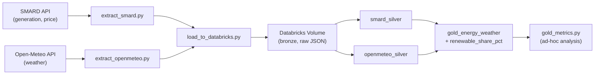

# DE Energy Lakehouse

A pipeline that ingests German electricity generation/consumption data (SMARD, Bundesnetzagentur) and weather data (Open-Meteo), transforms it through a medallion architecture (bronze → silver → gold) in Databricks/Delta Lake, and answers the question:

_How does weather affect the share of renewable energy and electricity prices in Germany?_

**Status: work in progress.** The core pipeline (extract → silver → gold) runs end-to-end. Orchestration, data quality tests, infrastructure-as-code, and a dashboard are planned — see In progress below.

## Key finding

Analysis across ~52 weeks of data shows a correlation of -0.75 between the share of renewable energy (wind + solar) and the wholesale electricity price — hours with a high renewable share consistently have lower prices, consistent with the merit-order effect on energy markets.

Additional findings:

- Renewable share occasionally exceeds 100% (e.g. on public holidays combined with strong solar output) — Germany produces more renewable energy than it consumes in those hours.
- Prices were negative in ~5% of hours over the year, reflecting periods of significant oversupply.
- The lowest renewable share occurred during a "Dunkelflaute" period (simultaneous low wind and low sun).

## Architecture



**Medallion layers:**
- **Bronze** — raw JSON, untouched, stored on a Databricks volume
- **Silver** — cleaned per source: correct types, readable names, one row per hour (`smard_silver`, `openmeteo_silver`)
- **Gold** — joined data plus derived metrics, ready for analysis (`gold_energy_weather`)
## How this runs
 
- **`src/ingestion/`** — runs locally (Python). Fetches raw data from the SMARD and Open-Meteo APIs and uploads it to a Databricks volume.
- **`src/transform/`** — runs inside Databricks (PySpark). `spark` is provided automatically by the Databricks runtime and is not imported explicitly — these scripts are version-controlled here for review, and executed as Databricks notebooks/jobs.

## Tech stack
 
Python · SMARD API · Open-Meteo API · Databricks (PySpark, Delta Lake) · Unity Catalog

## Project structure
 
```
src/
  ingestion/
    extract_smard.py        # SMARD: generation, consumption, price
    extract_openmeteo.py    # Open-Meteo: wind, radiation, temperature
    load_to_databricks.py   # uploads raw data to a Databricks volume
  transform/
    smard_silver.py         # bronze → silver (SMARD)
    openmeteo_silver.py     # bronze → silver (Open-Meteo)
    gold_energy_weather.py  # silver → gold (join + renewable_share_pct)
    gold_metrics.py         # ad-hoc analysis on the gold table
```

## How to run
 
1. Clone the repo and install dependencies:
```
   pip install -r requirements.txt
```
2. Copy `.env.example` to `.env` and fill in your Databricks host/token:
```
   DATABRICKS_HOST=https://your-workspace.cloud.databricks.com
   DATABRICKS_TOKEN=your-token
```
3. Run ingestion (fetches data and uploads it to the volume):
```
   python src/ingestion/extract_smard.py
   python src/ingestion/extract_openmeteo.py
   python src/ingestion/load_to_databricks.py
```
4. In Databricks, run in order (as a notebook or job): `smard_silver.py` → `openmeteo_silver.py` → `gold_energy_weather.py` → `gold_metrics.py`.

## In progress
 
- dbt data quality tests (`not_null`, `accepted_values`, custom tests)
- Automated orchestration (GitHub Actions, daily schedule)
- CI/CD (lint, unit tests)
- AWS S3 as the data lake + Terraform (currently a Databricks volume)
- Dashboard (Streamlit or Databricks SQL)

## Limitations
 
- Covers wind (on/offshore) and solar as renewable sources; biomass and hydro are not included.
- Weather is averaged across 4 representative locations (Hamburg, Munich, Berlin, Karlsruhe), not full spatial resolution.
- Orchestration is currently manual; a production version would use Airflow or a GitHub Actions schedule.